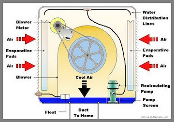
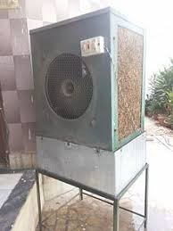
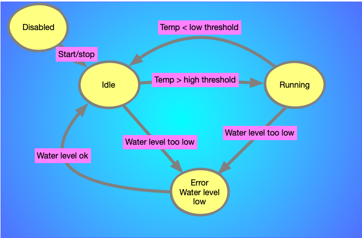

# CPE 301 Semester Project, Fall 2021

This is a team project whose purpose is to give you experience developing an embedded system that uses multiple sensors, using a variety of protocols and methods.

# Overview

The goal is to create an evaporation cooling system (aka a swamp cooler). In dry, hot climates, evaporation coolers provide a more energy-efficient alternative to air conditioners. Air is pulled in from the outside through a pad that is soaked in water. The evaporation of the water cools and humidifies the air. As they rely on evaporation, they do not work in humid climates.

The schematic below shows the general operation of the cooler.

Here is an image of a cooler without external panels attached so that the pad and fan are visible.

# Project Requirements

Your team is to build a working cooler using the Arduino 2560 and sensors from the Arduino kit that we use for labs.

The completed project will

* Monitor the water levels in a reservoir and print an alert when the level is too low
* Monitor and display the current air temp and humidity on an LCD screen
* Start and stop a fan motor as needed when the temperature falls out of a specified range (high or low)
* Allow a user to use a control to adjust the angle of an output vent from the system
* Allow a user to enable or disable the system using an on/off button
* Record the time and date every time the motor is turned on or off. This information should be transmitted to a host computer (over USB)

## Cooler States

The cooler continuously cycles through a number of states, with state transitions triggered by the user or by events such as temperature changes. The state diagram is shown below.

## State Descriptions

* All states except DISABLED
       * Humidity and temperature should be continuously monitored and reported on the LDC screen
       * The system should respond to changes in vent position control
       * Stop button should turn off motor (if on) and system should go to DISABLED state

* DISABLED
       * YELLOW LED should be lit
       * No monitoring of temperature or water should be performed
       * The start button should be monitored

* IDLE
  * The system should monitor temperature and transition to running state when temperature > threshold (you determine the threshold)
  * The exact time (using real-time clock) should record transition times
  * The water level should be continuously monitored and the state changed to error if the level is too low
  * GREEN LED should be lit

* ERROR
  * RED LED should be turned on (all other LEDs turned off)
  * The motor should be off and not start regardless of temperature
  * The system should transition to IDLE as soon as the water is at an acceptable level
  * An error message should be displayed on LCD

* RUNNING
  * BLUE LED should be turned on (all other LEDs turned off)
  * The motor should be on
  * The system should transition to IDLE as soon as the temperature drops below the lower threshold
  * The system should transition to the ERROR state if water becomes too low

# Deliverables
## Project Overview Document

This document is a single PDF containing the following:

* An overview of the design and any constraints on the system (example: operating temperatures, power requirements, etc)
* Pictures of the final system and a link to a video of the system in operation
* A complete schematic, and links to all relevant specification sheets for the components used
* A link to the Github repository

## Github Repository

The repository link must be turned in to WebCampus. The README for the project must include the group name and the names of all team members. The commits to Github will be reviewed and will be assessed based on the comments (no "asdf" comments!) and the contributions from all team members.

## Video Of Operation

A short video must be turned in showing the system in operation. There should be some narration as the project is demonstrated. Music is ok, however, points will be taken off if anything from Nickleback is used.
